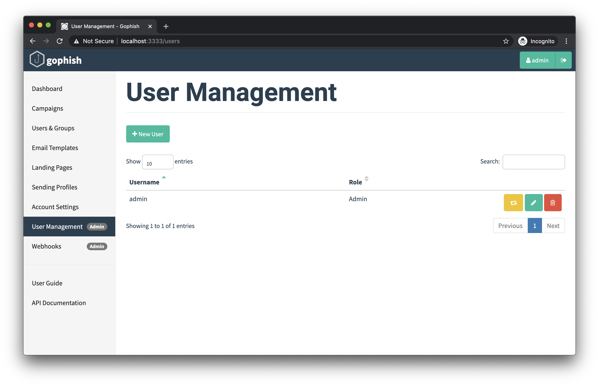
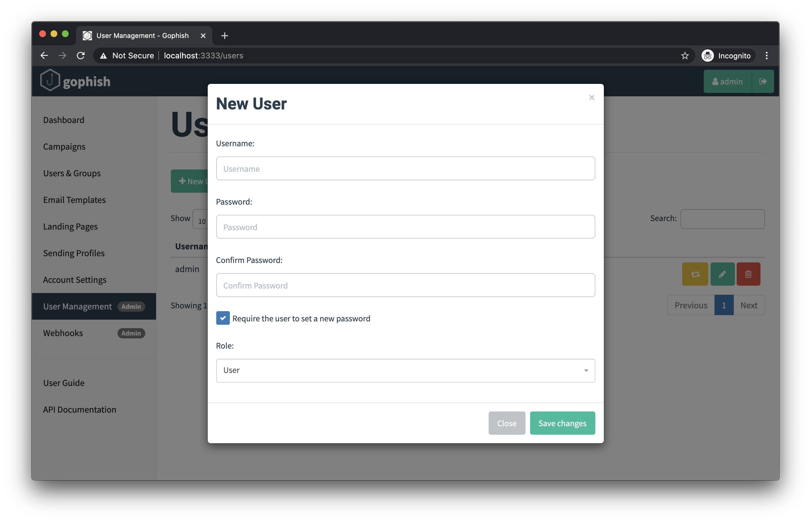

# User Management

Gophish supports user accounts with different roles. There are three separate roles that can be assigned to users:

* **User** - This role allows the user to do anything _except_ system-level administrative tasks, such as managing users, managing webhooks, etc.
* **Admin** - This is a system-level administrative role that has full permissions to manage the Gophish installation
* **Auditor** - A read-only role. Auditors can view their team's campaigns, results, templates, landing pages, groups, and sending profiles, but cannot create, edit, launch, or delete anything

To register new user accounts and manage existing ones, login as an administrative user and navigate to the "User Management" page:

## Registering a New User

To register a new user, click the **"+ New User**" button, which will cause the following dialog to appear:

In this form, you can choose the username, password, role, team, and whether or not the user is required to reset their password when they first login.

## Teams

Every user belongs to a team, set through the "Team" field when creating or editing an account. Campaigns, templates, landing pages, groups, and sending profiles are owned by the team rather than by the individual who created them, so everyone on the same team sees and works on the same objects. Typing a team name that doesn't exist yet creates that team.

Use separate teams to keep unrelated engagements apart. Bear in mind what team membership grants: every member can read the other members' target lists and campaign results, and can read back the password stored in a shared sending profile. Only an administrator can move an account to a different team.

IMAP (email reporting) settings are deliberately **not** shared, they stay tied to the individual account, since they hold one persons mailbox credentials rather than a shared campaign asset.

## Delete a User

To delete a user, click the red trash can icon next to the username in the users list.

!!! info
    You are required to have at least one user with the "Admin" role at all times. If you try to delete the last administrative user, Gophish will return an error.

Deleting an account removes only the account itself. The campaigns, templates, landing pages, groups, and sending profiles it created are owned by the team and stay in place for the remaining members.

## Impersonate A User

There may be cases where a user in Gophish is running into issues and would like help troubleshooting. To support this, Gophish has the ability to let administrators "impersonate" any user.

By clicking the yellow button next to the username in the users list, you will automatically be logged into a session for the given user, and interact with Gophish on that user's behalf.

When you are ready to return to your administrative session, you will need to logout, and log back in using your administrative credentials.

