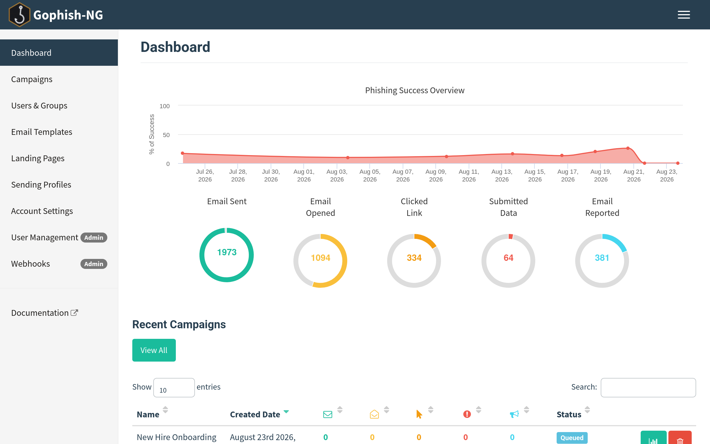

# Introduction

## Welcome to Gophish-NG!

Gophish-NG is an actively maintained fork of [Gophish](https://github.com/gophish/gophish),
the widely used, battle-tested open-source phishing toolkit for pentesters
and businesses running real-world phishing simulations and security
awareness training.

Gophish-NG keeps everything Gophish already does well — landing pages,
email templates, target groups, sending profiles, and per-recipient
tracking through a single web UI — while modernizing the dependency and
toolchain foundation underneath it. See [What is Gophish?](about/what-is.md)
for more background, or jump straight to [Installation](getting-started/installation.md)
to get running.

This user guide introduces Gophish-NG and shows how to use the software,
building a complete campaign from start to finish.

